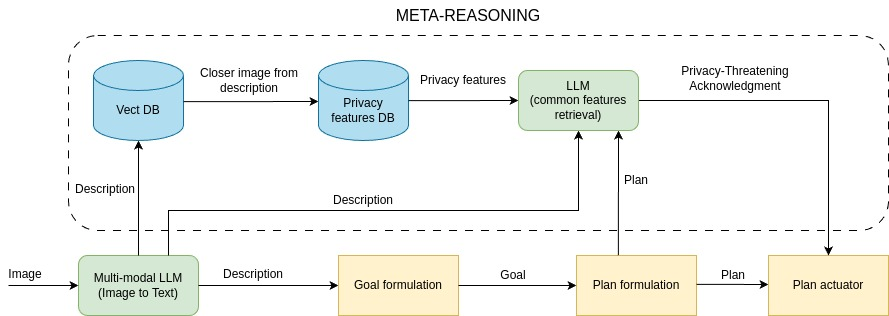

# IMMAGENE
Intelligent Multi-Modal Agents based on GEnerative Narrative Evaluation.

This is the repository of the Python (3.7+) implementation of IMMAGENE (**I**ntelligent **M**ulti-**M**odal **A**gents based on **Ge**nerative **N**arrative **E**valuation), 
for the evaluation of intelligent agent based on generative multi-modal narrative. IMMAGENE is built on top of the framework [PHIDIAS](https://ceur-ws.org/Vol-2502/paper5.pdf).




## Requirements installation

This repository has been tested on Python 3.10 64bit (Windows 10/PopOs linux), with the following packages versions:

* [PHIDIAS](https://github.com/corradosantoro/phidias) (release 1.3.4.alpha) 

### PHIDIAS

---------------

```sh
> git clone https://github.com/corradosantoro/phidias
> cd phidias
> pip install -r requirements.txt
> pip install .
```


### pillow

---------------

```sh
> pip install pillow
```

### opencv

---------------

```sh
> pip install opencv-python
```


### Pandas


```sh
> pip install pandas
> pip install openpyxl
```


### pymongo

---------------

```sh
> pip install pymongo
```


### MongoDB

---------------
* Install a new Mongodb community instance from [here](https://www.mongodb.com/try/download/community) (a GUI Compass installation is also recommended from [here](https://www.mongodb.com/products/tools/compass)), then create a new database named *ad-caspar* containing a collection *clauses* (the easier way is by using Compass). The url of the MongoDB server must be specified by changing the value of HOST (section LKB) in config.ini.

* Create a new mongodb user in the Mongo shell (or Compass shell) as it follows:
```sh
> use dipa
> db.createUser({
  user: "root",
  pwd: "example",
  roles: [
    { role: "readWrite", db: "dipa" }
  ]
})
```


### MongoDB (Docker use case)

---------------
In the case MongoDB container, Mongo Express can be accessed by the link: http://localhost:8087/ (admin/tribes).

```sh
> docker-compose -f mongo.yaml up
```

### Pandas


```sh
> pip install pandas
> pip install openpyxl
```

## Framework setup

bla bla bla


### Asynchronous/Non-Asynchronous Meta-Reasoning

---------------
bla bla bla


### Images description dataset preparation

---------------
This framework's meta-reasoning relies on the annotated images dataset [DIPA](https://dl.acm.org/doi/abs/10.1145/3581754.3584176).

* Download the dataset from this [link](https://dl.acm.org/doi/suppl/10.1145/3581754.3584176/suppl_file/dataset.zip)
* Set the proper variables in the file [create_img_descr.py](create_img_descr.py)
* Run the above create_img_descr.py and build the images dataset descriptions in excel (output_excel).


### Vect DB building

---------------
* Set the proper variables in the file [create_vect_db.py](create_vect_db.py).
* Run the above create_vect_db.py to build the sqlite3 vectorial database. 
* Run [inferece_vect_db.py](inferece_vect_db.py) to test the Vect DB with a text.


### Privacy features NoSql DB building

---------------
* Set the proper variables im the file [create_nosql_db.py](create_nosql_db.py)
* Run the above create_nosql_db.py to build the NoSql database.
* Run [query_nosql_db.py](query_nosql_db.py) to test the NoSql database (e.g 00b4064b073e51f3) 


## Running IMMAGENE

bla bla bla
